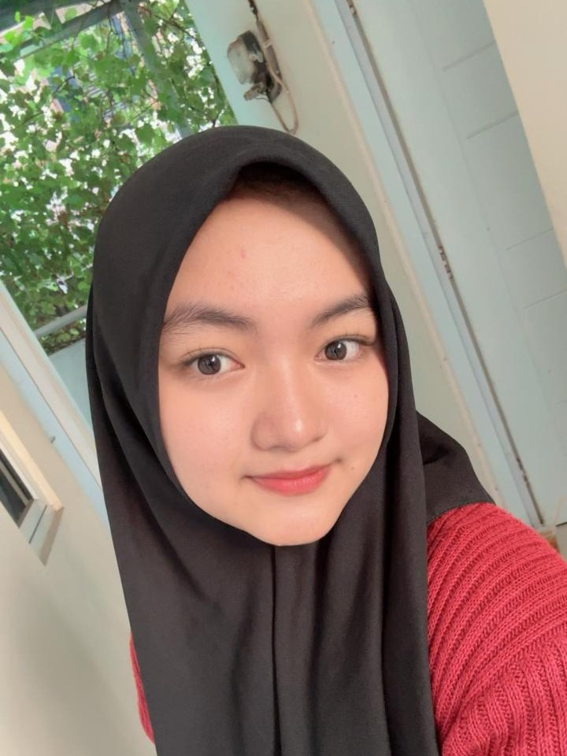

<html lang="id">
<head>
  <meta charset="utf-8" />
  <meta name="viewport" content="width=device-width, initial-scale=1" />
  <title>Blog Galaxy — Profil & 4 Post Tes</title>
  
</head>
<body>
  

    <header>
      

        
      

      

        <h1>SONIA KEMALA PUTRI</h1>
        
Mahasiswa Teknik Informatika UBP Karawang

        

          
NIM : 24416255201103

          
if24.soniaputri@mhs.ubpkarawang.ac.id

          
Basis Data

        

      

    </header>

      

    <iframe src="https://www.youtube.com/embed/lI3t8a3YoVQ?si=TqQirVeOWTC6CoiA" 
      title="YouTube video" allowfullscreen></iframe>
  

    <main id="posts">
      

        <article class="card">
          <h3>Post 2: Apa itu Attribute, Entitas, dan Relasi dalam ERD?</h3>
          
Dalam <em>Entity Relationship Diagram (ERD)</em>, ada tiga komponen utama yang digunakan untuk memodelkan data:

      <ul>
        <li><strong>Atribut (Attribute)</strong> → Atribut adalah ciri atau informasi yang dimiliki entitas.  
           Contoh:</li>
          
Produk → <strong>ID Produk, Nama Produk, Harga, Stok</strong>
 
          
Pelanggan → <strong>Pelanggan, Nama, Email, Alamat</strong>

          
Pesanan → <strong>Pesanan, Tanggal Pesan, Total Harga</strong>
 
        <li><strong>Entitas (Entity)</strong> → Entitas adalah objek nyata atau konsep yang datanya ingin disimpan.  
           Contoh di toko online : <em>Produk, Pelanggan, Pesanan.</em>.</li>
          
Produk = barang yang dijual.
 
          
Pelanggan = orang yang membeli.
 
          
Pesanan = transaksi pembelian.

        <li><strong>Relasi (Relationship)</strong> → Relasi adalah hubungan antar entitas.  
           Contoh:</li>
          
Pelanggan membuat Pesanan
 
          
Pesanan berisi Produk
 
      </ul>
        </article>
      

      <footer>
      © 2025 Blog Basis Data | <a href="https://www.ubpkarawang.ac.id" target="_blank">UBP Karawang</a>

      </footer>
    </main>
  

</body>
</html>
